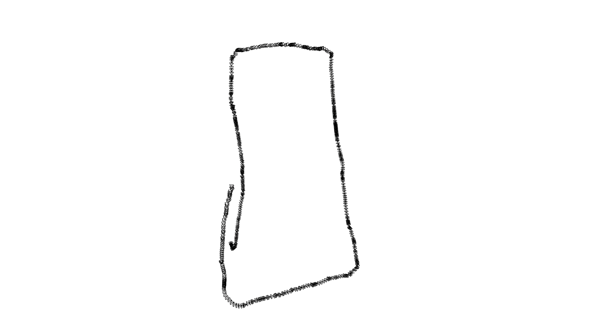
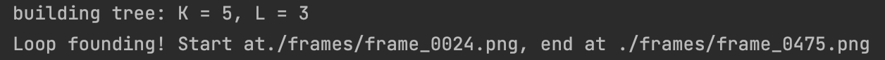
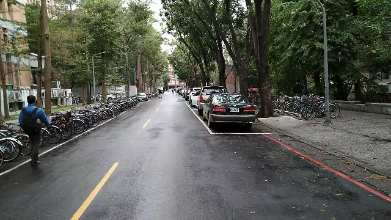
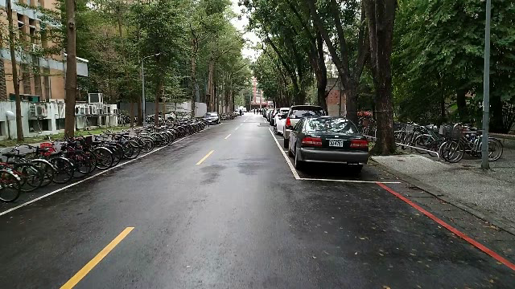

# **Visual Odometry**


## **Method in each step**
### **Step 1: Camera calibration**
running camera_calibration.py to get camera intrinsic matrix and distortion coefficient  
### **Step 2: Feature Matching**
Use ORB to get features and matching
### **Step 3: Pose from Epipolar Geometry**
```sh
Algorithm Get Pose

Input: Feature matchings of two images

get Essential matrix and inliers by input feature matchings using findEssentialMat api in Opencv
get relative rotation, normal vector of translation, inlers and 3D triangulated points by using recoverPose api in Opencv
get keypoints in image which are used by recoverPose api on inter-loop(previous image pair and current image pair)
get scale factor by calculating median of ratios between any two 3D points(correspondence to 2D keypoints) distance in current triangulated point set and previous triangulated point set 
multiply scale factor to normal vector of translation to get estimated relative translation

Output: Relative rotation and translation
```
### **Step4: Result Visualization:**
Get new pose by doing relative rotation and translation on previous pose and draw by open3d


## **Bonus: Loop detection**
Code is referenced to [here](https://github.com/itswcg/DBow-Python)
```sh
Algorithm Loop detection

Input: input image

Get features of all images by using ORB fataure detection algorithm
Construct k-mean tree by using kmeans api in Opencv
For image in frames
  Query image to get counting times on each leaf to form a vector
  FInd highest cosine similarity with current image's vector from previous images, cosine similarity should >= 0.9 and there are more than 30 frames between two images
If three continuous frames mapping to three continuous frames respectively before, then there is a loop

Output: whether there is a loop
```
### **Result**

The result shows that loop start at frame_0024.png, end at frame_0475.png

frame_0024.png|frame_0475.png
|:-:|:-:|
|


## **Build environment**
```shell
conda create --name VO python=3.8 
conda activate VO
pip install -r requirements.txt 
```

## **How to run code**
```shell
python vo.py ./frames
```
Program will show the trajectory and the frame video, after drawing the trajectory, program will do loop detection. When there is a loop, program will show the start frame and end frame of the loop on the command line.

## **Demo video**
[link](https://youtu.be/xaIv8VYsjoM)
